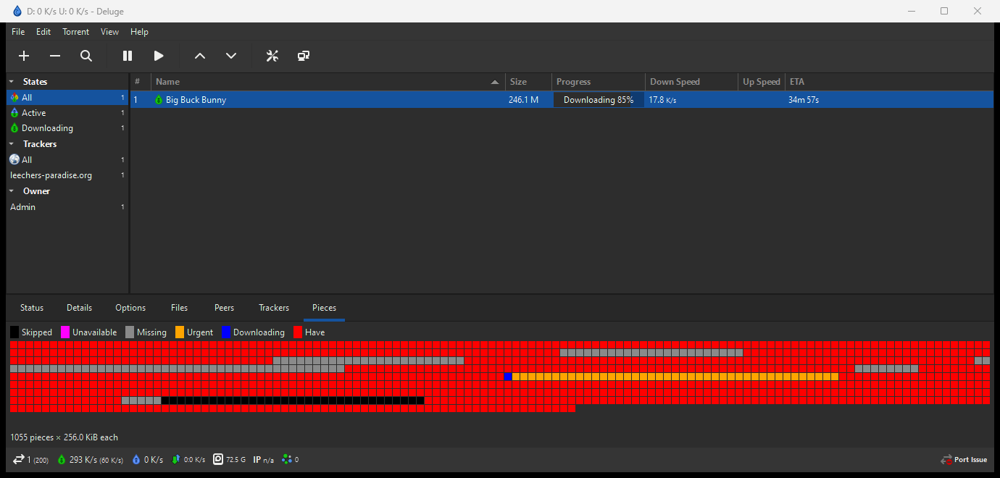

# deluge-piece-priority

A Deluge plugin for controlling libtorrent's native per-piece priority and
deadlines (`piece_priority`, `set_piece_deadline`) over Deluge's
existing RPC channel, plus WebUI and GTK3 UI panels built on that same RPC
surface.



## Compatibility

- Deluge 2.0, 2.1, or 2.2, with libtorrent 1.2 or 2.0
- Python 3.9+
- Linux, macOS, or Windows

## Install

```bash
curl -fsSL https://raw.githubusercontent.com/Jonny-GM/deluge-piece-priority/main/install.sh | bash
```

```powershell
irm https://raw.githubusercontent.com/Jonny-GM/deluge-piece-priority/main/install.ps1 | iex
```

This downloads the right build for your Python version and installs it
into Deluge's plugin folder. Then restart `deluged` (and `deluge-web`, if
you use it) and enable **PiecePriority** from Preferences → Plugins.

## Spec docs

- [Overview](docs/spec/00-overview.md) — what this is, scope, non-goals, compatibility
- [Core RPC](docs/spec/01-core-rpc.md) — the RPC contract: methods, error semantics
- [libtorrent semantics](docs/spec/02-libtorrent-semantics.md) — priority vs. deadline, interaction with Deluge's own sequential-download, persistence
- [WebUI](docs/spec/03-webui.md)
- [GTK3 UI](docs/spec/04-gtkui.md)
- [Packaging and compatibility](docs/spec/05-packaging-compat.md) — entry points, config schema, version matrix

## Development

```bash
uv venv --system-site-packages -p python3.12 .venv
uv pip install --python .venv/bin/python -e . --group dev
.venv/bin/python -m pytest tests/
```

Tests run against the real `deluge` and `libtorrent` Python packages — a
fake `torrent_handle` stands in for a live torrent, so no running
`deluged` is needed. The venv is created by hand because it must see a
system-installed `libtorrent` (`--system-site-packages`, which `uv sync`
doesn't support); libtorrent's compiled extension is tied to a specific
Python ABI, so build the venv with the interpreter your system's package
actually targets (check with e.g. `python3.12 -c "import libtorrent"`).
The full reasoning lives in [AGENTS.md](AGENTS.md), "Development
environment".
